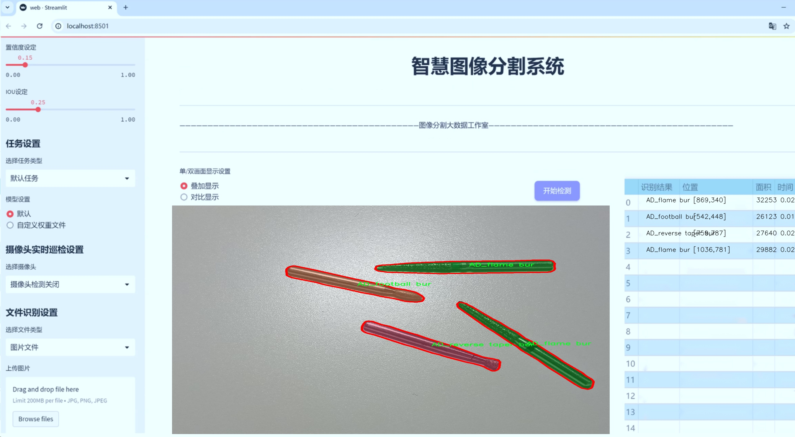
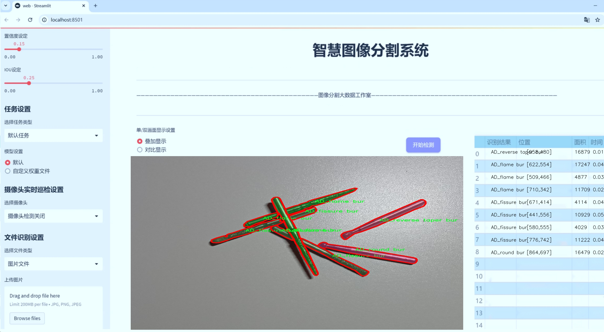
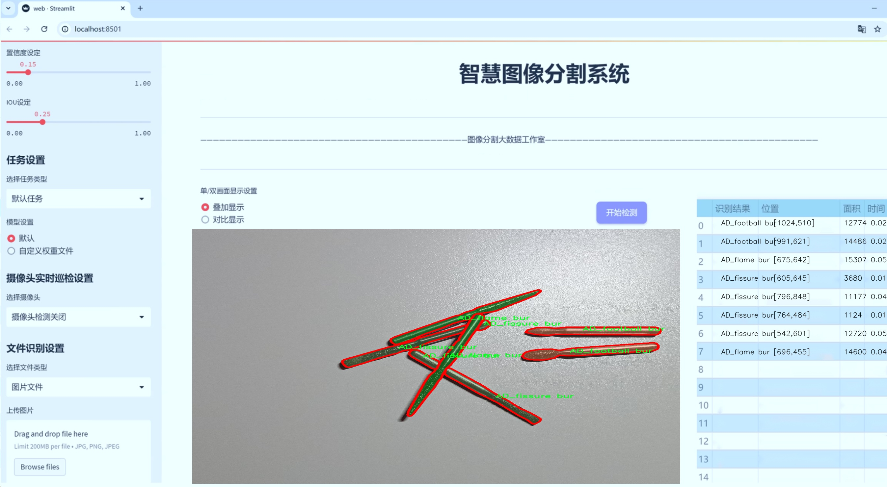
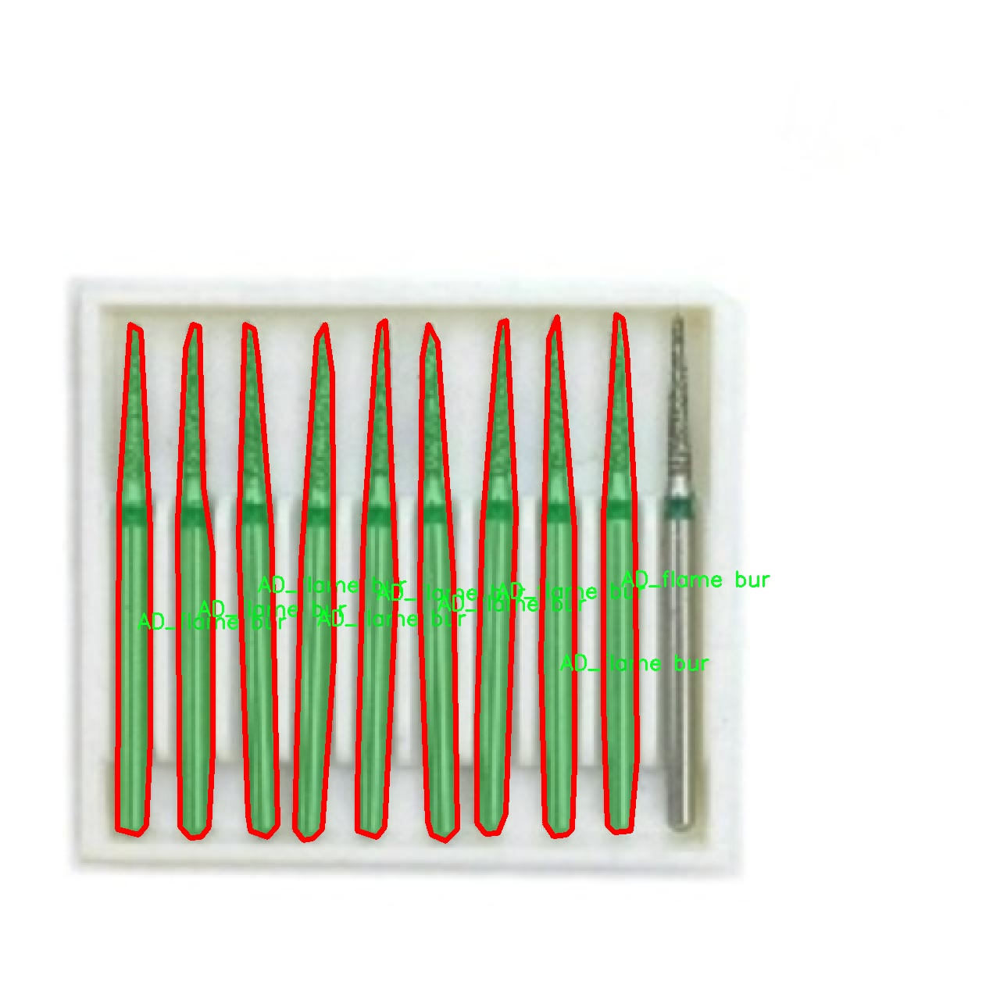
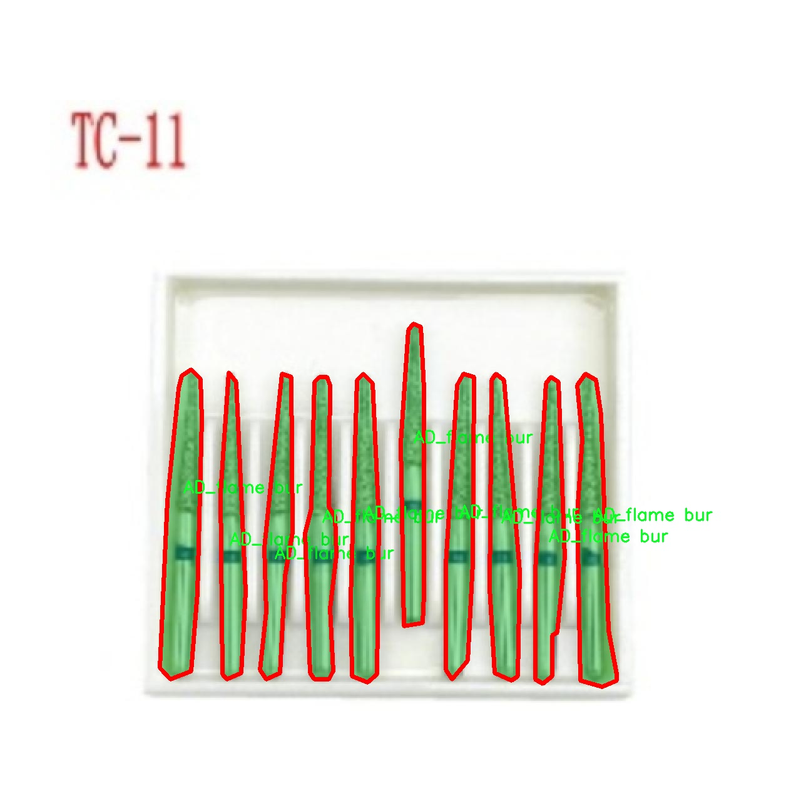
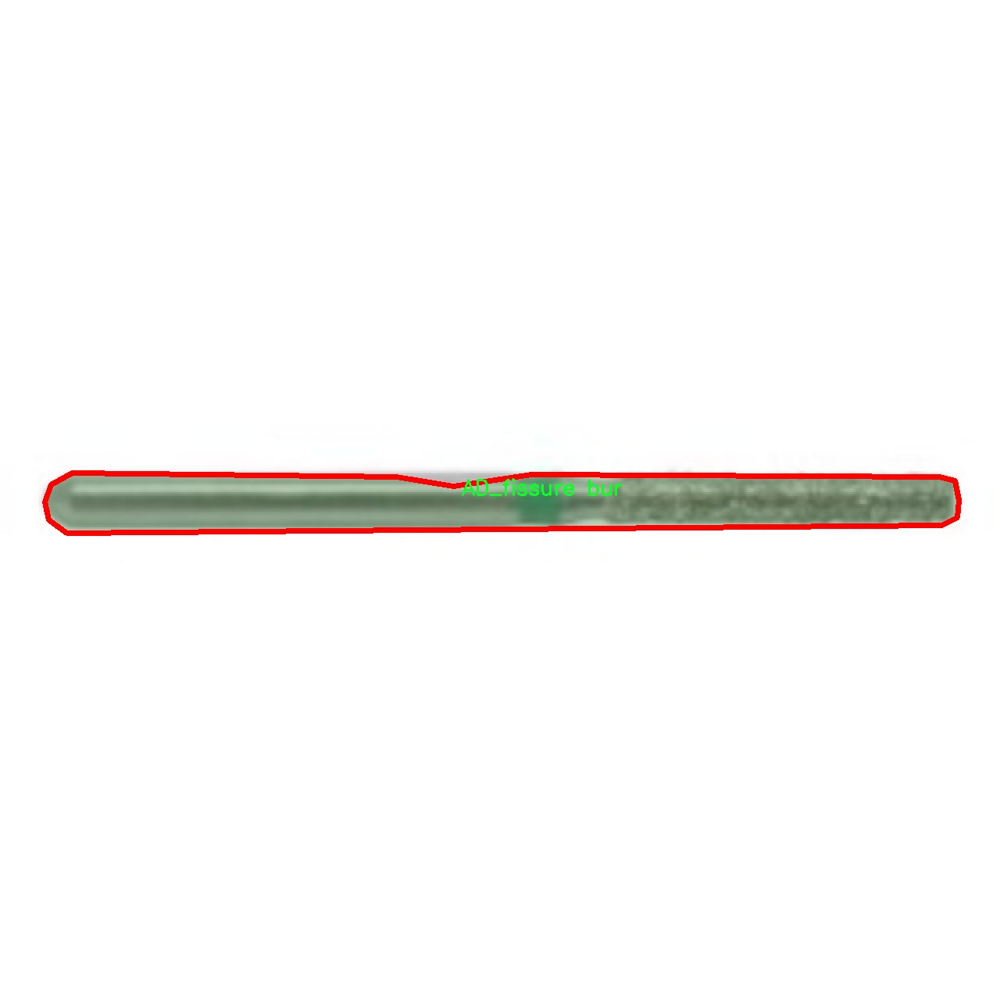
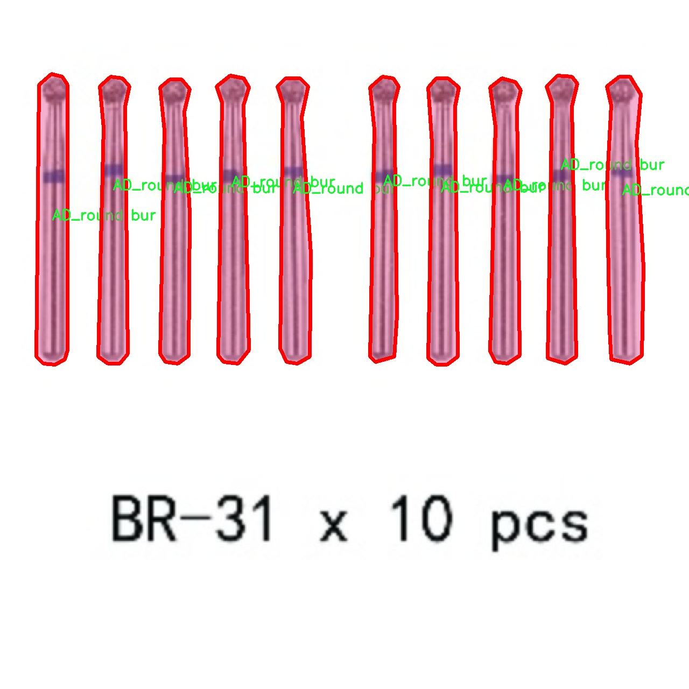
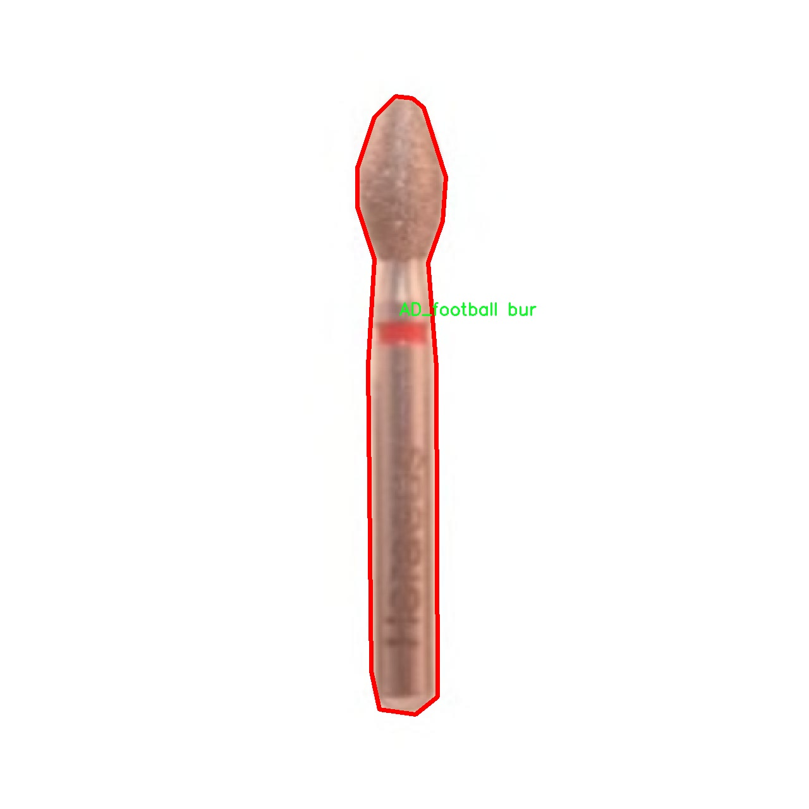

# 气动铣刀型号分类图像分割系统： yolov8-seg-C2f-SCConv

### 1.研究背景与意义

[参考博客](https://gitee.com/YOLOv8_YOLOv11_Segmentation_Studio/projects)

[博客来源](https://kdocs.cn/l/cszuIiCKVNis)

研究背景与意义

随着工业自动化和智能制造的快速发展，计算机视觉技术在制造业中的应用日益广泛，尤其是在精密加工领域。气动铣刀作为一种重要的切削工具，其性能直接影响到加工质量和效率。因此，准确地对气动铣刀进行分类和识别，成为提升生产效率和产品质量的关键环节。传统的气动铣刀分类方法往往依赖于人工经验，效率低下且易受主观因素影响。近年来，深度学习技术的迅猛发展为图像处理和物体识别提供了新的解决方案，尤其是基于卷积神经网络（CNN）的目标检测和分割算法，展现出了优异的性能。

YOLO（You Only Look Once）系列算法因其高效的实时检测能力而受到广泛关注。YOLOv8作为该系列的最新版本，进一步提升了检测精度和速度，适用于复杂场景下的物体识别与分割任务。然而，针对气动铣刀的特定应用场景，YOLOv8的标准模型可能无法充分发挥其潜力。因此，基于YOLOv8的改进，构建一个专门针对气动铣刀型号分类的图像分割系统，具有重要的研究意义。

本研究将使用一个包含1100张图像的专用数据集，涵盖五种不同类别的气动铣刀：AD_fissure bur、AD_flame bur、AD_football bur、AD_reverse taper bur和AD_round bur。通过对这些图像进行实例分割，系统能够准确识别和区分不同型号的气动铣刀，从而为后续的加工过程提供有效支持。与传统的分类方法相比，基于改进YOLOv8的图像分割系统不仅能够提高分类的准确性，还能在复杂背景下保持良好的鲁棒性。

此外，研究的意义还体现在其对制造业智能化转型的推动作用。通过实现气动铣刀的自动识别与分类，能够有效减少人工干预，提高生产线的自动化水平。这不仅能够降低生产成本，还能提升生产效率，为企业在激烈的市场竞争中提供更强的竞争力。同时，该系统的成功应用还可以为其他类型的切削工具或零部件的智能识别提供借鉴，推动整个制造行业的智能化进程。

综上所述，基于改进YOLOv8的气动铣刀型号分类图像分割系统的研究，不仅具有重要的理论价值，也具备广泛的实际应用前景。通过深入探讨和解决气动铣刀分类中的关键技术问题，能够为智能制造领域的发展提供新的思路和方法，助力制造业的转型升级。

### 2.图片演示







注意：本项目提供完整的训练源码数据集和训练教程,由于此博客编辑较早,暂不提供权重文件（best.pt）,需要按照6.训练教程进行训练后实现上图效果。

### 3.视频演示

[3.1 视频演示](https://www.bilibili.com/video/BV124UmY6E93/)

### 4.数据集信息

##### 4.1 数据集类别数＆类别名

nc: 5
names: ['AD_fissure bur', 'AD_flame bur', 'AD_football bur', 'AD_reverse taper bur', 'AD_round bur']


##### 4.2 数据集信息简介

数据集信息展示

在现代制造业和精密加工领域，气动铣刀的分类与识别是提升生产效率和加工质量的重要环节。为此，我们构建了一个专门用于训练改进YOLOv8-seg的气动铣刀型号分类图像分割系统的数据集，命名为“AeratorFrez”。该数据集旨在为气动铣刀的自动化识别提供高质量的图像数据支持，助力相关算法的优化与应用。

“AeratorFrez”数据集包含五个主要类别，分别是：AD_fissure bur、AD_flame bur、AD_football bur、AD_reverse taper bur和AD_round bur。这些类别代表了气动铣刀在形状、用途和设计上的不同特征，涵盖了从细小裂缝处理到广泛应用的多种铣刀类型。每个类别的图像均经过精心挑选和标注，确保数据的准确性和多样性，以便于模型在训练过程中能够学习到丰富的特征信息。

在数据集的构建过程中，我们采用了多种拍摄角度和光照条件，以增强模型的鲁棒性。每个类别下的图像数量均衡，确保模型在学习时不会偏向某一特定类别。这种均衡的设计不仅提高了模型的泛化能力，还使得其在实际应用中能够更好地适应不同的工作环境和任务需求。

此外，数据集中的图像分辨率经过优化，确保在保持图像清晰度的同时，能够有效减少计算资源的消耗。每张图像都经过严格的预处理，包括去噪、归一化和增强等步骤，以提升数据质量。这些预处理措施使得模型在训练时能够更快地收敛，并提高了最终的分类和分割精度。

为了便于研究人员和开发者使用，我们为“AeratorFrez”数据集提供了详细的文档，包含数据集的结构、类别说明以及使用示例。这些文档旨在帮助用户快速上手，并有效利用该数据集进行模型训练和测试。我们鼓励研究人员在此基础上进行进一步的探索与创新，推动气动铣刀识别技术的发展。

总之，“AeratorFrez”数据集不仅是气动铣刀型号分类图像分割系统的基础数据来源，更是推动相关领域研究和应用的重要工具。通过高质量的数据集，我们期望能够提升YOLOv8-seg模型在气动铣刀识别任务中的表现，进而为智能制造和自动化加工提供强有力的技术支持。随着技术的不断进步和数据集的不断完善，我们相信，气动铣刀的自动化识别将迎来更加广阔的应用前景。











### 5.项目依赖环境部署教程（零基础手把手教学）

[5.1 环境部署教程链接（零基础手把手教学）](https://www.bilibili.com/video/BV1jG4Ve4E9t/?vd_source=bc9aec86d164b67a7004b996143742dc)


[5.2 安装Python虚拟环境创建和依赖库安装视频教程链接（零基础手把手教学）](https://www.bilibili.com/video/BV1nA4VeYEze/?vd_source=bc9aec86d164b67a7004b996143742dc)

### 6.手把手YOLOV8-seg训练视频教程（零基础手把手教学）

[6.1 手把手YOLOV8-seg训练视频教程（零基础小白有手就能学会）](https://www.bilibili.com/video/BV1cA4VeYETe/?vd_source=bc9aec86d164b67a7004b996143742dc)


按照上面的训练视频教程链接加载项目提供的数据集，运行train.py即可开始训练



     Epoch   gpu_mem       box       obj       cls    labels  img_size
     1/200     0G   0.01576   0.01955  0.007536        22      1280: 100%|██████████| 849/849 [14:42<00:00,  1.04s/it]
               Class     Images     Labels          P          R     mAP@.5 mAP@.5:.95: 100%|██████████| 213/213 [01:14<00:00,  2.87it/s]
                 all       3395      17314      0.994      0.957      0.0957      0.0843

     Epoch   gpu_mem       box       obj       cls    labels  img_size
     2/200     0G   0.01578   0.01923  0.007006        22      1280: 100%|██████████| 849/849 [14:44<00:00,  1.04s/it]
               Class     Images     Labels          P          R     mAP@.5 mAP@.5:.95: 100%|██████████| 213/213 [01:12<00:00,  2.95it/s]
                 all       3395      17314      0.996      0.956      0.0957      0.0845

     Epoch   gpu_mem       box       obj       cls    labels  img_size
     3/200     0G   0.01561    0.0191  0.006895        27      1280: 100%|██████████| 849/849 [10:56<00:00,  1.29it/s]
               Class     Images     Labels          P          R     mAP@.5 mAP@.5:.95: 100%|███████   | 187/213 [00:52<00:00,  4.04it/s]
                 all       3395      17314      0.996      0.957      0.0957      0.0845


### 7.50+种全套YOLOV8-seg创新点加载调参实验视频教程（一键加载写好的改进模型的配置文件）

[7.1 50+种全套YOLOV8-seg创新点加载调参实验视频教程（一键加载写好的改进模型的配置文件）](https://www.bilibili.com/video/BV1Hw4VePEXv/?vd_source=bc9aec86d164b67a7004b996143742dc)

### YOLOV8-seg算法简介

原始YOLOV8-seg算法原理

YOLOv8-seg算法是由Ultralytics公司于2023年推出的最新目标检测和分割算法，代表了YOLO系列的又一次重大进步。该算法不仅在目标检测方面展现出色的性能，同时也引入了图像分割的能力，使得其在复杂场景下的应用更加广泛。YOLOv8-seg在YOLOv8的基础上，进一步优化了网络结构和损失函数，增强了特征提取和融合的能力，提升了模型的整体性能。

首先，YOLOv8-seg算法的主干网络采用了CSP（Cross Stage Partial）结构，这一设计理念源于YOLOv5的成功经验。CSP结构通过将特征提取过程分为两个部分，分别进行卷积和连接，有效地缓解了深层网络中的梯度消失问题。在YOLOv8-seg中，C3模块被C2f模块替代，C2f模块的设计灵感来自于YOLOv7的ELAN思想。C2f模块通过引入多个分支和shortcut连接，增强了特征的重用能力，使得网络在进行特征提取时能够获得更加丰富的梯度流信息。具体而言，C2f模块由多个CBS（Convolution + Batch Normalization + SiLU）模块和若干个Bottleneck构成，这种结构不仅提升了模型的学习能力，还有效地降低了计算复杂度。

在特征融合方面，YOLOv8-seg采用了PAN-FPN（Path Aggregation Network - Feature Pyramid Network）结构。该结构通过自下而上的方式将高层特征与中层和浅层特征进行融合，确保了不同尺度特征之间的信息流动和交互。具体来说，YOLOv8-seg在特征融合过程中，首先对高层特征进行上采样，然后与中层特征进行连接，最后再与浅层特征进行融合。这种多尺度特征融合的策略使得模型能够在不同的分辨率下，准确地检测和分割目标，尤其是在处理小目标时，表现尤为突出。

YOLOv8-seg在检测网络的设计上，采用了Anchor-Free的检测方式，抛弃了传统的Anchor-Base方法。这一转变使得模型在处理不同尺寸和形状的目标时，具有更高的灵活性和适应性。YOLOv8-seg的Detect模块使用了解耦头结构，这种结构将分类和回归任务分开处理，从而提高了模型的精度和效率。此外，YOLOv8-seg引入了新的损失函数，包括VFLLoss作为分类损失，以及DFLLoss和CIoULoss作为边界框回归损失。这些损失函数的设计旨在解决样本不平衡和困难样本的影响，使得模型在训练过程中能够更好地学习到目标的特征。

在数据预处理方面，YOLOv8-seg沿用了YOLOv5的策略，采用了多种数据增强手段，如马赛克增强、混合增强、空间扰动和颜色扰动等。这些增强手段不仅丰富了训练数据的多样性，还有效提高了模型的鲁棒性和泛化能力。输入到YOLOv8-seg的图像经过640x640的标准化处理后，经过CBS网络进行特征提取。CBS结构通过卷积层提取目标的纹理和颜色特征，同时利用归一化技术解决反向传播过程中的梯度消失和爆炸问题，进而提高了模型的收敛速度和效果。

在YOLOv8-seg的Head部分，模型输出三个不同尺度的特征图，分别为80x80、40x40和20x20。这些特征图经过解耦处理后，分别用于目标分类和边框回归。通过Softmax和卷积操作，模型将特征图转换为真实的边界框格式，并进行目标类别的预测。值得注意的是，YOLOv8-seg在边框回归过程中采用了Distribution Focal Loss，这一损失函数通过积分形式的表示法，有效地解决了小目标检测中的样本不平衡问题。

综上所述，YOLOv8-seg算法通过引入多种先进的网络结构和损失函数，结合高效的特征提取和融合策略，显著提升了目标检测和分割的性能。其在处理复杂场景和小目标时的优势，使得YOLOv8-seg在实际应用中具有广泛的前景。未来，随着算法的不断优化和改进，YOLOv8-seg有望在更多领域中发挥重要作用。


### 9.系统功能展示（检测对象为举例，实际内容以本项目数据集为准）

图9.1.系统支持检测结果表格显示

  图9.2.系统支持置信度和IOU阈值手动调节

  图9.3.系统支持自定义加载权重文件best.pt(需要你通过步骤5中训练获得)

  图9.4.系统支持摄像头实时识别

  图9.5.系统支持图片识别

  图9.6.系统支持视频识别

  图9.7.系统支持识别结果文件自动保存

  图9.8.系统支持Excel导出检测结果数据


### 10.50+种全套YOLOV8-seg创新点原理讲解（非科班也可以轻松写刊发刊，V11版本正在科研待更新）

#### 10.1 由于篇幅限制，每个创新点的具体原理讲解就不一一展开，具体见下列网址中的创新点对应子项目的技术原理博客网址【Blog】：


[10.1 50+种全套YOLOV8-seg创新点原理讲解链接](https://gitee.com/qunmasj/good)

#### 10.2 部分改进模块原理讲解(完整的改进原理见上图和技术博客链接)【如果此小节的图加载失败可以通过CSDN或者Github搜索该博客的标题访问原始博客，原始博客图片显示正常】
### YOLOv8简介
#### Yolov8网络模型
Yolov8n的网络分为输入端、主干网( Back-bone) 、Neck模块和输出端4个部分（图4)。输
人端主要有马赛克( Mosaic）数据增强、自适应锚框计算和自适应灰度填充。主干网有Conv、C2和SPPF结构，其中，C2r模块是对残差特征进行学习的主要模块，该模块仿照Yolov7的ELAN结构,通过更多的分支跨层连接，丰富了模型的梯度流，可形成一个具有更强特征表示能力的神经网络模
块。Neck模块采用PAN ( path aggregation nelwOrk ,结构，可加强网络对不同缩放尺度对象特征融合的
能力。输出端将分类和检测过程进行解耦，主要包括损失计算和目标检测框筛选，其中，损失计算过程主要包括正负样本分配策略和 Loss计算，Yolov8n 网络主要使用TaskAlignedAssignerl 10]方法，即根据分类与回归的分数加权结果选择正样本;Loss计算包括分类和回归2个分支，无Ob-jecIness分支。分类分支依然采用BCE Loss，回归分支则使用了Distribution Focal Loss!11〕和CIOU( complele inlersection over union)损失函数。

### 可扩张残差（DWR）注意力模块
当前的许多工作直接采用多速率深度扩张卷积从一个输入特征图中同时捕获多尺度上下文信息，从而提高实时语义分割的特征提取效率。 然而，这种设计可能会因为结构和超参数的不合理而导致多尺度上下文信息的访问困难。 为了降低绘制多尺度上下文信息的难度，我们提出了一种高效的多尺度特征提取方法，该方法分解了原始的单步特征提取方法方法分为两个步骤，区域残差-语义残差。 在该方法中，多速率深度扩张卷积在特征提取中发挥更简单的作用：根据第一步提供的每个简明区域形式特征图，在第二步中使用一个所需的感受野执行简单的基于语义的形态过滤 一步，提高他们的效率。 此外，扩张率和扩张卷积的容量每个网络阶段都经过精心设计，以充分利用所有可以实现的区域形式的特征图。 因此，我们分别为高层和低层网络设计了一种新颖的扩张式残差（DWR）模块和简单倒置残差（SIR）模块。


首先，该博客引入了一个Dilation-wise Residual（DWR）模块，用于提取网络高层的特征，如图2a所示。多分支结构用于扩展感受野，其中每个分支采用不同空洞率的空洞深度卷积。
然后，专门设计了一个Simple Inverted Residual（SIR）模块来提取网络低层的特征，如图2b所示。该模块仅具有3×3的微小感受野，但使用inverted bottleneck式结构来扩展通道数量，确保更强的特征提取能力。
最后，基于DWR和SIR模块，构建了一个编码器-解码器风格的网络DWRSeg，其中解码器采用了简单的类似FCN的结构。解码器使用来自最后两个阶段的强语义信息直接对特征图进行上采样，然后将它们与来自较低阶段的特征图（包含丰富的详细信息）拼接起来，以进行最终预测。


### 11.项目核心源码讲解（再也不用担心看不懂代码逻辑）

#### 11.1 ultralytics\utils\callbacks\hub.py

以下是对代码的核心部分进行提炼和详细注释的结果：

```python
# Ultralytics YOLO 🚀, AGPL-3.0 license

import json
from time import time
from ultralytics.hub.utils import HUB_WEB_ROOT, PREFIX, events
from ultralytics.utils import LOGGER, SETTINGS

def on_fit_epoch_end(trainer):
    """在每个训练周期结束时上传训练进度指标。"""
    session = getattr(trainer, 'hub_session', None)  # 获取训练器的会话信息
    if session:
        # 组合训练损失和指标
        all_plots = {**trainer.label_loss_items(trainer.tloss, prefix='train'), **trainer.metrics}
        if trainer.epoch == 0:
            from ultralytics.utils.torch_utils import model_info_for_loggers
            # 在第一个周期时添加模型信息
            all_plots = {**all_plots, **model_info_for_loggers(trainer)}
        
        # 将当前周期的指标序列化为JSON并存入队列
        session.metrics_queue[trainer.epoch] = json.dumps(all_plots)
        
        # 检查是否超过上传频率限制
        if time() - session.timers['metrics'] > session.rate_limits['metrics']:
            session.upload_metrics()  # 上传指标
            session.timers['metrics'] = time()  # 重置计时器
            session.metrics_queue = {}  # 重置队列

def on_model_save(trainer):
    """在保存模型时上传检查点，遵循速率限制。"""
    session = getattr(trainer, 'hub_session', None)  # 获取训练器的会话信息
    if session:
        is_best = trainer.best_fitness == trainer.fitness  # 判断当前模型是否是最佳模型
        # 检查是否超过上传频率限制
        if time() - session.timers['ckpt'] > session.rate_limits['ckpt']:
            LOGGER.info(f'{PREFIX}上传检查点 {HUB_WEB_ROOT}/models/{session.model_id}')
            session.upload_model(trainer.epoch, trainer.last, is_best)  # 上传模型
            session.timers['ckpt'] = time()  # 重置计时器

def on_train_end(trainer):
    """在训练结束时上传最终模型和指标到Ultralytics HUB。"""
    session = getattr(trainer, 'hub_session', None)  # 获取训练器的会话信息
    if session:
        LOGGER.info(f'{PREFIX}同步最终模型...')
        # 上传最终模型和指标
        session.upload_model(trainer.epoch, trainer.best, map=trainer.metrics.get('metrics/mAP50-95(B)', 0), final=True)
        session.alive = False  # 停止心跳
        LOGGER.info(f'{PREFIX}完成 ✅\n'
                    f'{PREFIX}查看模型在 {HUB_WEB_ROOT}/models/{session.model_id} 🚀')

# 定义回调函数字典，根据设置决定是否启用
callbacks = {
    'on_fit_epoch_end': on_fit_epoch_end,
    'on_model_save': on_model_save,
    'on_train_end': on_train_end,
} if SETTINGS['hub'] is True else {}  # 验证是否启用
```

### 代码分析和注释：

1. **导入模块**：引入必要的模块，包括时间处理、JSON处理以及Ultralytics的工具和日志记录功能。

2. **`on_fit_epoch_end` 函数**：
   - 该函数在每个训练周期结束时被调用，用于上传训练过程中的指标。
   - 它会将当前周期的损失和其他指标组合在一起，并在第一个周期时添加模型信息。
   - 如果超过了上传频率限制，则会将指标上传到服务器。

3. **`on_model_save` 函数**：
   - 该函数在模型保存时被调用，用于上传模型检查点。
   - 它会检查当前模型是否是最佳模型，并在满足条件时上传模型。
   - 同样，它会遵循上传频率限制。

4. **`on_train_end` 函数**：
   - 该函数在训练结束时被调用，用于上传最终模型和相关指标。
   - 它会记录上传信息，并在上传完成后停止心跳。

5. **回调函数字典**：
   - 根据设置决定是否启用特定的回调函数，这些函数在训练、验证和预测等不同阶段被调用。

通过这些核心部分和注释，可以清晰地理解代码的主要功能和逻辑。

这个文件是Ultralytics YOLO项目中的一个回调函数模块，主要用于在训练、验证和预测过程中与Ultralytics HUB进行交互。文件中定义了一系列回调函数，这些函数在特定事件发生时被调用，以记录训练进度、上传模型和指标等。

首先，文件导入了一些必要的库和模块，包括`json`和`time`，以及Ultralytics HUB相关的工具和日志记录器。接着，定义了一些回调函数：

- `on_pretrain_routine_end(trainer)`：这个函数在预训练例程结束时被调用。它检查训练器是否有与HUB会话相关的属性，如果有，则记录模型的查看链接，并启动上传速率限制的计时器。

- `on_fit_epoch_end(trainer)`：在每个训练周期结束时调用，负责上传训练进度的指标。它将训练损失和其他指标合并为一个字典，并在满足速率限制的条件下上传这些指标。

- `on_model_save(trainer)`：在模型保存时调用，负责将检查点上传到Ultralytics HUB。它会检查当前模型是否是最佳模型，并在满足速率限制的条件下上传模型。

- `on_train_end(trainer)`：在训练结束时调用，上传最终模型和指标到Ultralytics HUB。它会记录上传的过程，并在完成后停止心跳信号。

- `on_train_start(trainer)`、`on_val_start(validator)`、`on_predict_start(predictor)`和`on_export_start(exporter)`：这些函数在训练、验证、预测和导出开始时调用，主要用于执行与这些事件相关的操作。

最后，文件中定义了一个`callbacks`字典，将各个回调函数与相应的事件关联起来。这个字典的创建是基于设置中的`hub`选项，如果启用，则将回调函数添加到字典中。

总体来说，这个文件的主要功能是通过回调机制与Ultralytics HUB进行交互，确保在训练和模型管理过程中能够有效地记录和上传相关信息。

#### 11.2 ultralytics\models\yolo\detect\val.py

以下是经过简化和注释的核心代码部分，主要保留了YOLO检测验证器的核心功能和流程：

```python
import os
import torch
from ultralytics.data import build_dataloader, build_yolo_dataset, converter
from ultralytics.engine.validator import BaseValidator
from ultralytics.utils import LOGGER, ops
from ultralytics.utils.metrics import ConfusionMatrix, DetMetrics, box_iou

class DetectionValidator(BaseValidator):
    """
    YOLO检测模型的验证器类，继承自BaseValidator。
    """

    def __init__(self, dataloader=None, save_dir=None, args=None):
        """初始化检测模型，设置必要的变量和参数。"""
        super().__init__(dataloader, save_dir, args)
        self.metrics = DetMetrics(save_dir=self.save_dir)  # 初始化检测指标
        self.iouv = torch.linspace(0.5, 0.95, 10)  # 设置IoU阈值范围
        self.niou = self.iouv.numel()  # IoU数量

    def preprocess(self, batch):
        """对输入的图像批次进行预处理。"""
        # 将图像数据转移到设备上并归一化
        batch['img'] = batch['img'].to(self.device, non_blocking=True) / 255
        # 将其他数据转移到设备上
        for k in ['batch_idx', 'cls', 'bboxes']:
            batch[k] = batch[k].to(self.device)
        return batch

    def postprocess(self, preds):
        """对预测结果应用非极大值抑制（NMS）。"""
        return ops.non_max_suppression(preds, self.args.conf, self.args.iou)

    def update_metrics(self, preds, batch):
        """更新检测指标。"""
        for si, pred in enumerate(preds):
            idx = batch['batch_idx'] == si  # 获取当前批次的索引
            cls = batch['cls'][idx]  # 获取当前批次的真实类别
            bbox = batch['bboxes'][idx]  # 获取当前批次的真实边界框
            npr = pred.shape[0]  # 当前批次的预测数量

            if npr == 0:  # 如果没有预测结果
                continue

            # 处理预测结果
            predn = pred.clone()  # 克隆预测结果
            ops.scale_boxes(batch['img'][si].shape[1:], predn[:, :4], batch['ori_shape'][si])  # 将预测框转换为原始图像空间

            # 计算IoU并更新指标
            if cls.shape[0] > 0:  # 如果有真实标签
                correct_bboxes = self._process_batch(predn, torch.cat((cls, bbox), 1))  # 处理批次
            self.stats.append((correct_bboxes, pred[:, 4], pred[:, 5], cls.squeeze(-1)))  # 保存统计信息

    def _process_batch(self, detections, labels):
        """计算正确预测的矩阵。"""
        iou = box_iou(labels[:, 1:], detections[:, :4])  # 计算IoU
        return self.match_predictions(detections[:, 5], labels[:, 0], iou)  # 匹配预测与标签

    def get_stats(self):
        """返回指标统计信息。"""
        stats = [torch.cat(x, 0).cpu().numpy() for x in zip(*self.stats)]  # 转换为numpy数组
        if len(stats) and stats[0].any():
            self.metrics.process(*stats)  # 处理指标
        return self.metrics.results_dict  # 返回结果字典

    def print_results(self):
        """打印每个类别的训练/验证集指标。"""
        pf = '%22s' + '%11i' * 2 + '%11.3g' * len(self.metrics.keys)  # 打印格式
        LOGGER.info(pf % ('all', self.seen, self.nt_per_class.sum(), *self.metrics.mean_results()))  # 打印总体结果
```

### 代码注释说明：
1. **DetectionValidator类**：这是YOLO检测模型的验证器，负责处理验证过程中的数据预处理、指标更新和结果打印等功能。
2. **__init__方法**：初始化验证器，设置指标、IoU阈值等。
3. **preprocess方法**：对输入的图像批次进行预处理，包括数据转移和归一化。
4. **postprocess方法**：应用非极大值抑制，过滤掉重叠的预测框。
5. **update_metrics方法**：更新当前批次的检测指标，包括处理预测结果和计算IoU。
6. **_process_batch方法**：计算预测框与真实框之间的IoU，并返回正确预测的矩阵。
7. **get_stats方法**：返回统计信息，处理并返回指标结果。
8. **print_results方法**：打印每个类别的验证结果，包括总体和每个类别的指标。

这个程序文件是一个用于YOLO（You Only Look Once）目标检测模型验证的Python脚本，属于Ultralytics库的一部分。它主要负责在给定的数据集上评估YOLO模型的性能，计算各种指标，并可视化结果。

首先，程序导入了一些必要的库和模块，包括文件操作、NumPy、PyTorch等。接着，它定义了一个名为`DetectionValidator`的类，该类继承自`BaseValidator`，用于处理目标检测的验证过程。

在`__init__`方法中，初始化了一些必要的变量和设置，包括数据加载器、保存目录、进度条、参数等。它还定义了一些与评估相关的指标，如`DetMetrics`和`ConfusionMatrix`，并设置了IoU（Intersection over Union）向量，用于计算mAP（mean Average Precision）。

`preprocess`方法负责对输入的图像批次进行预处理，包括将图像数据转移到设备上、归一化处理等。如果设置了混合保存模式，还会处理边界框的标签。

`init_metrics`方法用于初始化评估指标，判断数据集是否为COCO格式，并设置相关的类映射和指标名称。

`get_desc`方法返回一个格式化的字符串，用于总结YOLO模型的类指标。

`postprocess`方法应用非极大值抑制（NMS）来处理模型的预测输出，以去除冗余的边界框。

`update_metrics`方法负责更新评估指标，通过计算正确的边界框和标签之间的匹配情况，来统计模型的预测性能。

`finalize_metrics`方法设置最终的指标值，包括速度和混淆矩阵。

`get_stats`方法返回评估统计信息和结果字典，计算每个类别的目标数量。

`print_results`方法打印训练或验证集的每个类别的指标，包括总的检测结果和每个类别的详细信息。

`_process_batch`方法用于处理每个批次的检测结果，计算IoU并返回正确的预测矩阵。

`build_dataset`和`get_dataloader`方法用于构建YOLO数据集和返回数据加载器，支持不同的批次大小和模式。

`plot_val_samples`和`plot_predictions`方法用于可视化验证图像样本和模型的预测结果，并将结果保存为图像文件。

`save_one_txt`方法将YOLO检测结果保存为特定格式的文本文件，而`pred_to_json`方法则将预测结果序列化为COCO格式的JSON文件。

最后，`eval_json`方法用于评估YOLO输出的JSON格式，计算性能统计信息，特别是针对COCO数据集的mAP指标。

整体而言，这个程序文件实现了YOLO模型在验证集上的评估流程，包括数据预处理、指标计算、结果可视化等功能，适用于目标检测任务的性能评估。

#### 11.3 ultralytics\data\loaders.py

以下是代码中最核心的部分，并附上详细的中文注释：

```python
import cv2
import numpy as np
import torch
from pathlib import Path
from threading import Thread
from urllib.parse import urlparse

class LoadStreams:
    """
    视频流加载器，用于处理多种类型的视频流（如RTSP、RTMP、HTTP等）。
    """

    def __init__(self, sources='file.streams', imgsz=640, vid_stride=1, buffer=False):
        """初始化流加载器，设置视频源、图像大小等参数。"""
        torch.backends.cudnn.benchmark = True  # 加速固定大小推理
        self.buffer = buffer  # 是否缓冲输入流
        self.running = True  # 线程运行标志
        self.imgsz = imgsz  # 图像大小
        self.vid_stride = vid_stride  # 视频帧率步幅
        sources = Path(sources).read_text().rsplit() if os.path.isfile(sources) else [sources]
        self.sources = [self.clean_str(x) for x in sources]  # 清理源名称
        n = len(self.sources)
        self.imgs, self.fps, self.frames, self.threads, self.shape = [[]] * n, [0] * n, [0] * n, [None] * n, [[]] * n
        self.caps = [None] * n  # 视频捕获对象

        for i, s in enumerate(sources):  # 遍历每个源
            # 启动线程读取视频流的帧
            self.caps[i] = cv2.VideoCapture(s)  # 存储视频捕获对象
            if not self.caps[i].isOpened():
                raise ConnectionError(f'无法打开 {s}')
            w = int(self.caps[i].get(cv2.CAP_PROP_FRAME_WIDTH))  # 获取视频宽度
            h = int(self.caps[i].get(cv2.CAP_PROP_FRAME_HEIGHT))  # 获取视频高度
            fps = self.caps[i].get(cv2.CAP_PROP_FPS)  # 获取视频帧率
            self.frames[i] = max(int(self.caps[i].get(cv2.CAP_PROP_FRAME_COUNT)), 0) or float('inf')  # 获取总帧数
            self.fps[i] = max((fps if np.isfinite(fps) else 0) % 100, 0) or 30  # 设置帧率

            success, im = self.caps[i].read()  # 读取第一帧
            if not success or im is None:
                raise ConnectionError(f'无法从 {s} 读取图像')
            self.imgs[i].append(im)  # 存储第一帧
            self.shape[i] = im.shape  # 存储图像形状
            self.threads[i] = Thread(target=self.update, args=([i, self.caps[i], s]), daemon=True)  # 启动线程
            self.threads[i].start()  # 启动线程

    def update(self, i, cap, stream):
        """在守护线程中读取视频流的帧。"""
        n = 0  # 帧计数
        while self.running and cap.isOpened():
            if len(self.imgs[i]) < 30:  # 保持缓冲区不超过30帧
                n += 1
                cap.grab()  # 抓取下一帧
                if n % self.vid_stride == 0:  # 根据步幅读取帧
                    success, im = cap.retrieve()
                    if not success:
                        im = np.zeros(self.shape[i], dtype=np.uint8)  # 如果读取失败，返回零图像
                    if self.buffer:
                        self.imgs[i].append(im)  # 如果缓冲，添加到图像列表
                    else:
                        self.imgs[i] = [im]  # 否则替换图像列表
            else:
                time.sleep(0.01)  # 等待缓冲区清空

    def close(self):
        """关闭流加载器并释放资源。"""
        self.running = False  # 停止线程
        for thread in self.threads:
            if thread.is_alive():
                thread.join(timeout=5)  # 等待线程结束
        for cap in self.caps:  # 释放视频捕获对象
            cap.release()
        cv2.destroyAllWindows()  # 关闭所有OpenCV窗口

    def __iter__(self):
        """返回迭代器对象。"""
        self.count = -1
        return self

    def __next__(self):
        """返回源路径、图像及其元数据。"""
        self.count += 1
        images = []
        for i, x in enumerate(self.imgs):
            while not x:  # 等待每个缓冲区中的帧
                time.sleep(1 / min(self.fps))  # 等待
                x = self.imgs[i]
            images.append(x.pop(0) if self.buffer else x.pop(-1))  # 获取并移除图像
        return self.sources, images, None, ''

    def __len__(self):
        """返回源对象的长度。"""
        return len(self.sources)  # 返回源数量

    @staticmethod
    def clean_str(s):
        """清理字符串，去除多余空格等。"""
        return s.strip()  # 返回去除空格的字符串
```

### 代码核心部分说明：
1. **LoadStreams类**：用于加载和处理视频流，支持多种视频源（如RTSP、RTMP等）。
2. **__init__方法**：初始化类的属性，包括视频源、图像大小、帧率等，并启动线程读取视频流。
3. **update方法**：在后台线程中不断读取视频流的帧，并将其存储在缓冲区中。
4. **close方法**：关闭视频流并释放相关资源。
5. **__iter__和__next__方法**：实现迭代器协议，允许在外部循环中使用该类。
6. **clean_str静态方法**：用于清理视频源字符串，去除多余的空格。

这些部分是实现视频流加载和处理的核心逻辑，能够支持YOLO模型的实时推理。

这个程序文件 `ultralytics\data\loaders.py` 是用于处理和加载图像、视频流以及截图的模块，主要用于与 YOLO（You Only Look Once）模型进行图像处理和推理。文件中定义了多个类，每个类负责不同类型的数据加载。

首先，文件引入了一些必要的库，包括用于图像处理的 OpenCV、NumPy、PIL，以及用于网络请求的 requests 库等。接着，定义了一个数据类 `SourceTypes`，用于表示不同的输入源类型，如网络摄像头、截图、图像文件和张量等。

接下来是 `LoadStreams` 类，它用于加载各种类型的视频流，包括 RTSP、RTMP、HTTP 和 TCP 流。该类的构造函数初始化了一些属性，包括源路径、图像大小、视频帧率步幅等，并通过多线程读取视频流的帧。类中还实现了 `update` 方法，用于在后台线程中不断读取视频帧，`close` 方法用于关闭视频流并释放资源，`__iter__` 和 `__next__` 方法则用于迭代读取帧。

`LoadScreenshots` 类用于处理屏幕截图，支持实时捕获屏幕内容。构造函数中使用了 `mss` 库来实现屏幕捕获，并定义了相关的捕获区域和图像大小。该类同样实现了迭代器方法，以便逐帧返回捕获的图像。

`LoadImages` 类则用于加载单张图像或视频文件。它支持从不同格式的文件中读取数据，并根据文件类型（图像或视频）进行处理。该类的构造函数会检查文件是否存在，并初始化视频捕获对象以便读取视频帧。

`LoadPilAndNumpy` 类用于从 PIL 图像和 NumPy 数组中加载图像数据，确保输入数据的格式正确，并提供了迭代器方法以便逐帧返回图像。

`LoadTensor` 类则专注于从 PyTorch 张量中加载图像数据，确保输入的张量格式符合要求，并提供了相应的迭代器方法。

最后，文件中还定义了一个 `autocast_list` 函数，用于将不同类型的输入源合并为 NumPy 数组或 PIL 图像的列表。此外，还有一个 `get_best_youtube_url` 函数，用于从给定的 YouTube 视频 URL 中提取最佳质量的 MP4 视频流。

总体来说，这个文件提供了一整套灵活的图像和视频数据加载机制，适用于 YOLO 模型的推理任务，支持多种输入源类型和格式，方便用户进行实时或批量的图像处理。

#### 11.4 ultralytics\models\rtdetr\train.py

以下是经过简化和注释的核心代码部分：

```python
# 导入必要的库
from copy import copy
import torch
from ultralytics.models.yolo.detect import DetectionTrainer
from ultralytics.nn.tasks import RTDETRDetectionModel
from ultralytics.utils import RANK, colorstr
from .val import RTDETRDataset, RTDETRValidator

class RTDETRTrainer(DetectionTrainer):
    """
    RT-DETR模型的训练类，专为实时目标检测而设计。
    该类扩展了YOLO的DetectionTrainer，以适应RT-DETR的特定特性和架构。
    """

    def get_model(self, cfg=None, weights=None, verbose=True):
        """
        初始化并返回一个用于目标检测任务的RT-DETR模型。

        参数:
            cfg (dict, optional): 模型配置，默认为None。
            weights (str, optional): 预训练模型权重的路径，默认为None。
            verbose (bool): 是否详细日志记录，默认为True。

        返回:
            (RTDETRDetectionModel): 初始化后的模型。
        """
        # 创建RT-DETR检测模型
        model = RTDETRDetectionModel(cfg, nc=self.data['nc'], verbose=verbose and RANK == -1)
        if weights:
            model.load(weights)  # 加载预训练权重
        return model

    def build_dataset(self, img_path, mode='val', batch=None):
        """
        构建并返回用于训练或验证的RT-DETR数据集。

        参数:
            img_path (str): 包含图像的文件夹路径。
            mode (str): 数据集模式，'train'或'val'。
            batch (int, optional): 矩形训练的批大小，默认为None。

        返回:
            (RTDETRDataset): 特定模式的数据集对象。
        """
        # 创建RT-DETR数据集
        return RTDETRDataset(img_path=img_path,
                             imgsz=self.args.imgsz,
                             batch_size=batch,
                             augment=mode == 'train',  # 训练模式下进行数据增强
                             hyp=self.args,
                             rect=False,
                             cache=self.args.cache or None,
                             prefix=colorstr(f'{mode}: '),  # 添加模式前缀
                             data=self.data)

    def get_validator(self):
        """
        返回适合RT-DETR模型验证的检测验证器。

        返回:
            (RTDETRValidator): 模型验证器对象。
        """
        self.loss_names = 'giou_loss', 'cls_loss', 'l1_loss'  # 定义损失名称
        return RTDETRValidator(self.test_loader, save_dir=self.save_dir, args=copy(self.args))

    def preprocess_batch(self, batch):
        """
        预处理一批图像，缩放并转换为浮点格式。

        参数:
            batch (dict): 包含图像、边界框和标签的批次字典。

        返回:
            (dict): 预处理后的批次。
        """
        batch = super().preprocess_batch(batch)  # 调用父类的预处理方法
        bs = len(batch['img'])  # 获取批次大小
        batch_idx = batch['batch_idx']  # 获取批次索引
        gt_bbox, gt_class = [], []  # 初始化真实边界框和类别列表
        for i in range(bs):
            # 根据批次索引提取每个图像的真实边界框和类别
            gt_bbox.append(batch['bboxes'][batch_idx == i].to(batch_idx.device))
            gt_class.append(batch['cls'][batch_idx == i].to(device=batch_idx.device, dtype=torch.long))
        return batch  # 返回预处理后的批次
```

### 代码说明：
1. **类定义**：`RTDETRTrainer`类继承自`DetectionTrainer`，用于训练RT-DETR模型。
2. **模型初始化**：`get_model`方法用于创建和加载RT-DETR模型。
3. **数据集构建**：`build_dataset`方法根据指定的模式（训练或验证）构建数据集。
4. **验证器获取**：`get_validator`方法返回一个适合RT-DETR的验证器，用于模型验证。
5. **批处理预处理**：`preprocess_batch`方法对输入的图像批次进行预处理，包括缩放和格式转换。

这个程序文件是一个用于训练RT-DETR模型的Python脚本，属于Ultralytics YOLO框架的一部分。RT-DETR是百度开发的一种实时目标检测模型，结合了视觉变换器（Vision Transformers）和一些特定的功能，如IoU感知查询选择和可调的推理速度。

文件中首先导入了一些必要的库和模块，包括PyTorch、DetectionTrainer类、RTDETRDetectionModel类以及用于验证的RTDETRDataset和RTDETRValidator类。

RTDETRTrainer类继承自DetectionTrainer类，主要用于适应RT-DETR模型的特性和架构。类的文档字符串中提到了一些注意事项，例如RT-DETR中使用的F.grid_sample不支持`deterministic=True`参数，以及AMP训练可能导致NaN输出和在二分图匹配过程中出现错误。

在类中，get_model方法用于初始化并返回一个RT-DETR模型。它接受模型配置、预训练权重路径和详细日志标志作为参数。该方法创建RTDETRDetectionModel实例，并在提供权重时加载它们。

build_dataset方法用于构建并返回一个RT-DETR数据集，支持训练和验证模式。它接受图像路径、模式（训练或验证）和批量大小作为参数，并返回相应的RTDETRDataset对象。

get_validator方法返回一个适合RT-DETR模型验证的检测验证器（DetectionValidator）。在这个方法中，定义了损失名称，包括giou_loss、cls_loss和l1_loss，并返回RTDETRValidator实例。

preprocess_batch方法用于预处理一批图像，将图像缩放并转换为浮点格式。它接受一个包含图像、边界框和标签的字典作为输入，并返回经过预处理的批次。在这个方法中，首先调用父类的预处理方法，然后提取每个图像的真实边界框和类别，并将它们转换为适当的设备和数据类型。

总的来说，这个文件定义了一个专门用于训练RT-DETR模型的训练器类，包含了模型初始化、数据集构建、验证器获取和批次预处理等功能，旨在支持高效的目标检测任务。

#### 11.5 ultralytics\models\sam\modules\tiny_encoder.py

以下是经过简化和注释的核心代码部分，主要包含了TinyViT模型的基本结构和关键组件。

```python
import torch
import torch.nn as nn
import torch.nn.functional as F

class Conv2d_BN(nn.Sequential):
    """一个顺序容器，执行2D卷积操作，后接批量归一化。"""
    
    def __init__(self, in_channels, out_channels, kernel_size=1, stride=1, padding=0):
        """初始化卷积层和批量归一化层。"""
        super().__init__()
        self.add_module('conv', nn.Conv2d(in_channels, out_channels, kernel_size, stride, padding, bias=False))
        self.add_module('bn', nn.BatchNorm2d(out_channels))

class PatchEmbed(nn.Module):
    """将图像嵌入为补丁并投影到指定的嵌入维度。"""
    
    def __init__(self, in_chans, embed_dim, resolution):
        """初始化补丁嵌入层。"""
        super().__init__()
        self.patches_resolution = (resolution // 4, resolution // 4)  # 计算补丁的分辨率
        self.seq = nn.Sequential(
            Conv2d_BN(in_chans, embed_dim // 2, kernel_size=3, stride=2, padding=1),
            nn.GELU(),  # 使用GELU激活函数
            Conv2d_BN(embed_dim // 2, embed_dim, kernel_size=3, stride=2, padding=1),
        )

    def forward(self, x):
        """前向传播，处理输入张量。"""
        return self.seq(x)

class MBConv(nn.Module):
    """Mobile Inverted Bottleneck Conv (MBConv)层。"""
    
    def __init__(self, in_chans, out_chans, expand_ratio):
        """初始化MBConv层。"""
        super().__init__()
        self.conv1 = Conv2d_BN(in_chans, in_chans * expand_ratio, kernel_size=1)
        self.conv2 = Conv2d_BN(in_chans * expand_ratio, in_chans * expand_ratio, kernel_size=3, padding=1, groups=in_chans * expand_ratio)
        self.conv3 = Conv2d_BN(in_chans * expand_ratio, out_chans, kernel_size=1, bn_weight_init=0.0)

    def forward(self, x):
        """前向传播，执行MBConv操作。"""
        x = self.conv1(x)
        x = self.conv2(x)
        x = self.conv3(x)
        return x

class TinyViTBlock(nn.Module):
    """TinyViT块，应用自注意力和局部卷积。"""
    
    def __init__(self, dim, num_heads):
        """初始化TinyViT块。"""
        super().__init__()
        self.attn = nn.MultiheadAttention(dim, num_heads)  # 多头自注意力
        self.local_conv = Conv2d_BN(dim, dim, kernel_size=3, padding=1)  # 局部卷积

    def forward(self, x):
        """前向传播，应用自注意力和局部卷积。"""
        x = self.attn(x, x, x)[0]  # 自注意力
        x = self.local_conv(x)  # 局部卷积
        return x

class TinyViT(nn.Module):
    """TinyViT模型架构。"""
    
    def __init__(self, img_size=224, in_chans=3, num_classes=1000):
        """初始化TinyViT模型。"""
        super().__init__()
        self.patch_embed = PatchEmbed(in_chans, embed_dim=96, resolution=img_size)  # 补丁嵌入层
        self.layers = nn.ModuleList([TinyViTBlock(dim=96, num_heads=3) for _ in range(4)])  # 多个TinyViT块
        self.head = nn.Linear(96, num_classes)  # 分类头

    def forward(self, x):
        """执行前向传播。"""
        x = self.patch_embed(x)  # 处理输入
        for layer in self.layers:
            x = layer(x)  # 通过每个TinyViT块
        return self.head(x)  # 分类输出
```

### 代码注释说明
1. **Conv2d_BN**: 该类实现了一个卷积层后接批量归一化，常用于卷积神经网络中以提高训练的稳定性和收敛速度。
2. **PatchEmbed**: 该类将输入图像分割成小块（补丁），并通过卷积层将其嵌入到一个高维空间中。
3. **MBConv**: 该类实现了移动反向瓶颈卷积层，适用于高效的特征提取，特别是在移动设备上。
4. **TinyViTBlock**: 该类实现了TinyViT的基本构建块，结合了自注意力机制和局部卷积操作。
5. **TinyViT**: 该类是整个TinyViT模型的实现，负责构建模型的整体结构，包括补丁嵌入、多个TinyViT块和分类头。

以上是TinyViT模型的核心部分，涵盖了其主要结构和功能。

这个程序文件实现了一个名为 TinyViT 的视觉模型架构，主要用于图像分类等视觉任务。该模型的设计灵感来源于 LeViT 和 Swin Transformer，采用了多种深度学习技术，如卷积、注意力机制和多层感知机（MLP）。

首先，文件中定义了一些基础组件。`Conv2d_BN` 类实现了一个包含二维卷积和批量归一化的顺序容器。`PatchEmbed` 类负责将输入图像嵌入为多个小块，并将其投影到指定的嵌入维度。`MBConv` 类实现了高效的 Mobile Inverted Bottleneck 卷积层，这是 EfficientNet 架构的一部分。

接下来，`PatchMerging` 类用于合并特征图中的相邻小块，并将其投影到新的维度。`ConvLayer` 类则由多个 MBConv 层组成，能够处理输入并提供激活输出。`Mlp` 类实现了一个多层感知机，包含层归一化和两个全连接层。

`Attention` 类实现了多头注意力机制，支持空间感知，能够根据空间分辨率应用注意力偏置。`TinyViTBlock` 类则结合了自注意力和局部卷积，对输入进行处理。

`BasicLayer` 类是 TinyViT 架构中的基本层，包含多个 TinyViTBlock，并可选择性地进行下采样。`LayerNorm2d` 类实现了二维的层归一化，适用于卷积层的输出。

最后，`TinyViT` 类是整个模型的核心，初始化时接受多个参数，如输入图像大小、输入通道数、类别数、嵌入维度、层深度、注意力头数等。该类构建了整个模型的层次结构，包括嵌入层、多个基本层和分类头。

在 `forward` 方法中，输入图像通过各个层进行前向传播，最终输出经过处理的特征。模型还实现了权重初始化和学习率衰减等功能，以优化训练过程。

总的来说，这个文件实现了一个灵活且高效的视觉模型 TinyViT，适用于多种视觉任务，并且具备良好的扩展性和可配置性。

### 12.系统整体结构（节选）

### 整体功能和构架概括

Ultralytics项目是一个用于目标检测和计算机视觉任务的深度学习框架，主要实现了YOLO系列模型及其变体。该框架的设计结构清晰，模块化程度高，便于扩展和维护。以下是各个模块的主要功能：

1. **回调机制**：用于在训练过程中与Ultralytics HUB进行交互，记录训练进度、上传模型和指标等。
2. **验证模块**：用于在验证集上评估YOLO模型的性能，计算各种指标，并可视化结果。
3. **数据加载**：提供灵活的图像和视频数据加载机制，支持多种输入源类型和格式。
4. **训练模块**：专门用于训练RT-DETR模型，包含模型初始化、数据集构建、验证器获取和批次预处理等功能。
5. **TinyViT模型**：实现了一个高效的视觉模型架构，适用于图像分类等视觉任务，结合了卷积和注意力机制。

### 文件功能整理表

| 文件路径                                      | 功能描述                                                                                       |
|-----------------------------------------------|-----------------------------------------------------------------------------------------------|
| `ultralytics/utils/callbacks/hub.py`        | 实现回调机制，与Ultralytics HUB交互，记录训练进度，上传模型和指标。                                   |
| `ultralytics/models/yolo/detect/val.py`     | 负责YOLO模型在验证集上的评估，计算各种性能指标，并可视化结果。                                      |
| `ultralytics/data/loaders.py`                | 提供图像、视频流和截图的加载机制，支持多种输入源类型和格式，方便实时或批量图像处理。                     |
| `ultralytics/models/rtdetr/train.py`         | 实现RT-DETR模型的训练流程，包括模型初始化、数据集构建、验证器获取和批次预处理等功能。                  |
| `ultralytics/models/sam/modules/tiny_encoder.py` | 实现TinyViT视觉模型架构，结合卷积和注意力机制，适用于图像分类等视觉任务。                              |

这个表格总结了每个文件的主要功能，帮助理解Ultralytics项目的整体架构和各个模块之间的关系。

### 13.图片、视频、摄像头图像分割Demo(去除WebUI)代码

在这个博客小节中，我们将讨论如何在不使用WebUI的情况下，实现图像分割模型的使用。本项目代码已经优化整合，方便用户将分割功能嵌入自己的项目中。
核心功能包括图片、视频、摄像头图像的分割，ROI区域的轮廓提取、类别分类、周长计算、面积计算、圆度计算以及颜色提取等。
这些功能提供了良好的二次开发基础。

### 核心代码解读

以下是主要代码片段，我们会为每一块代码进行详细的批注解释：

```python
import random
import cv2
import numpy as np
from PIL import ImageFont, ImageDraw, Image
from hashlib import md5
from model import Web_Detector
from chinese_name_list import Label_list

# 根据名称生成颜色
def generate_color_based_on_name(name):
    ......

# 计算多边形面积
def calculate_polygon_area(points):
    return cv2.contourArea(points.astype(np.float32))

...
# 绘制中文标签
def draw_with_chinese(image, text, position, font_size=20, color=(255, 0, 0)):
    image_pil = Image.fromarray(cv2.cvtColor(image, cv2.COLOR_BGR2RGB))
    draw = ImageDraw.Draw(image_pil)
    font = ImageFont.truetype("simsun.ttc", font_size, encoding="unic")
    draw.text(position, text, font=font, fill=color)
    return cv2.cvtColor(np.array(image_pil), cv2.COLOR_RGB2BGR)

# 动态调整参数
def adjust_parameter(image_size, base_size=1000):
    max_size = max(image_size)
    return max_size / base_size

# 绘制检测结果
def draw_detections(image, info, alpha=0.2):
    name, bbox, conf, cls_id, mask = info['class_name'], info['bbox'], info['score'], info['class_id'], info['mask']
    adjust_param = adjust_parameter(image.shape[:2])
    spacing = int(20 * adjust_param)

    if mask is None:
        x1, y1, x2, y2 = bbox
        aim_frame_area = (x2 - x1) * (y2 - y1)
        cv2.rectangle(image, (x1, y1), (x2, y2), color=(0, 0, 255), thickness=int(3 * adjust_param))
        image = draw_with_chinese(image, name, (x1, y1 - int(30 * adjust_param)), font_size=int(35 * adjust_param))
        y_offset = int(50 * adjust_param)  # 类别名称上方绘制，其下方留出空间
    else:
        mask_points = np.concatenate(mask)
        aim_frame_area = calculate_polygon_area(mask_points)
        mask_color = generate_color_based_on_name(name)
        try:
            overlay = image.copy()
            cv2.fillPoly(overlay, [mask_points.astype(np.int32)], mask_color)
            image = cv2.addWeighted(overlay, 0.3, image, 0.7, 0)
            cv2.drawContours(image, [mask_points.astype(np.int32)], -1, (0, 0, 255), thickness=int(8 * adjust_param))

            # 计算面积、周长、圆度
            area = cv2.contourArea(mask_points.astype(np.int32))
            perimeter = cv2.arcLength(mask_points.astype(np.int32), True)
            ......

            # 计算色彩
            mask = np.zeros(image.shape[:2], dtype=np.uint8)
            cv2.drawContours(mask, [mask_points.astype(np.int32)], -1, 255, -1)
            color_points = cv2.findNonZero(mask)
            ......

            # 绘制类别名称
            x, y = np.min(mask_points, axis=0).astype(int)
            image = draw_with_chinese(image, name, (x, y - int(30 * adjust_param)), font_size=int(35 * adjust_param))
            y_offset = int(50 * adjust_param)

            # 绘制面积、周长、圆度和色彩值
            metrics = [("Area", area), ("Perimeter", perimeter), ("Circularity", circularity), ("Color", color_str)]
            for idx, (metric_name, metric_value) in enumerate(metrics):
                ......

    return image, aim_frame_area

# 处理每帧图像
def process_frame(model, image):
    pre_img = model.preprocess(image)
    pred = model.predict(pre_img)
    det = pred[0] if det is not None and len(det)
    if det:
        det_info = model.postprocess(pred)
        for info in det_info:
            image, _ = draw_detections(image, info)
    return image

if __name__ == "__main__":
    cls_name = Label_list
    model = Web_Detector()
    model.load_model("./weights/yolov8s-seg.pt")

    # 摄像头实时处理
    cap = cv2.VideoCapture(0)
    while cap.isOpened():
        ret, frame = cap.read()
        if not ret:
            break
        ......

    # 图片处理
    image_path = './icon/OIP.jpg'
    image = cv2.imread(image_path)
    if image is not None:
        processed_image = process_frame(model, image)
        ......

    # 视频处理
    video_path = ''  # 输入视频的路径
    cap = cv2.VideoCapture(video_path)
    while cap.isOpened():
        ret, frame = cap.read()
        ......
```


### 14.完整训练+Web前端界面+50+种创新点源码、数据集获取


# [下载链接：https://mbd.pub/o/bread/Z5iZlZ1x](https://mbd.pub/o/bread/Z5iZlZ1x)